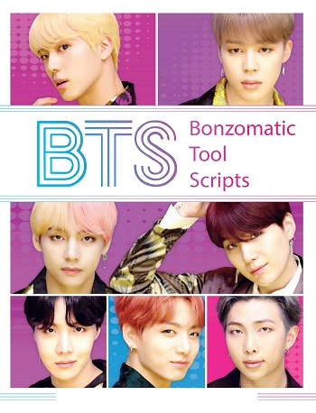

# Bonzo Tool Scripts (BTS)
Set of tool scripts for bonzomatic





Check here some [Tutorials](./TUTORIALS.md)

## Recorder
```
Record an entry from a websocket entrypoint

USAGE:
    bts.exe recorder [OPTIONS] --host <HOST> --room <ROOM> <HANDLE>

ARGS:
    <HANDLE>    Handle

OPTIONS:
    -h, --help                   Print help information
        --host <HOST>            Host or Host:Port
    -p, --protocol <PROTOCOL>    Protocol [default: ws]
        --room <ROOM>            Room
    -V, --version                Print version information
```

## Replayer
```
Replay a saved entry to a websocket entrypoint

USAGE:
    bts.exe replayer [OPTIONS] --host <HOST> --room <ROOM> <HANDLE> <FILE>

ARGS:
    <HANDLE>    Handles
    <FILE>      Input Json file

OPTIONS:
    -h, --help                                 Print help information
        --host <HOST>                          Host or Host:Port
    -p, --protocol <PROTOCOL>                  Protocol [default: ws]
        --room <ROOM>                          Room
        --update-interval <UPDATE_INTERVAL>    udpateInterval (ms) [default: 300]
    -V, --version                              Print version information
```

## Radio 
```
Send multiple shader at certain interval form a given playlist to an entrypoint, like a radio

USAGE:
    bts.exe radio [OPTIONS] --host <HOST> --room <ROOM> <HANDLE> <PATH>

ARGS:
    <HANDLE>    Handle
    <PATH>      Glob path of source files (playlist)

OPTIONS:
    -h, --help                                 Print help information
        --host <HOST>                          Host or Host:Port
    -p, --protocol <PROTOCOL>                  Protocol [default: ws]
        --room <ROOM>                          Room
        --time-per-entry <TIME_PER_ENTRY>      Time of boradcast per entry (ms) [default: 10000]
        --update-interval <UPDATE_INTERVAL>    udpateInterval (ms) [default: 500]
    -V, --version                              Print version information
```

Example : 
```
bts.exe radio --host drone.alkama.com:9000 --room test radio_test demo\playlist\**\*.glsl
```

And read with bonzomatic like this : 
```
.\Bonzomatic_W64_GLFW.exe  skipdialog networkMode=grabber serverURL=ws://drone.alkama.com:9000/test/radio_test
```

A long running radio will be playing a mix of glsl from https://livecode.demozoo.org at this address: `ws://drone.alkama.com:9000/livecode/radio`

You can listen via bonzomatic via this command line : 
```
.\Bonzomatic_W64_GLFW.exe  skipdialog networkMode=grabber serverURL=ws://drone.alkama.com:9000/livecode/radio
```

## Todo :

- Timeline ui to control the replay
- Option to launch preconfigured bonzomatic or generate command line for replayer and recorder
  - Option to launch a local server to avoid remote server dependecies (offline mode ?)

I'm learning Rust and a potato developer on this language. Feel free to PR so I can learn :)
